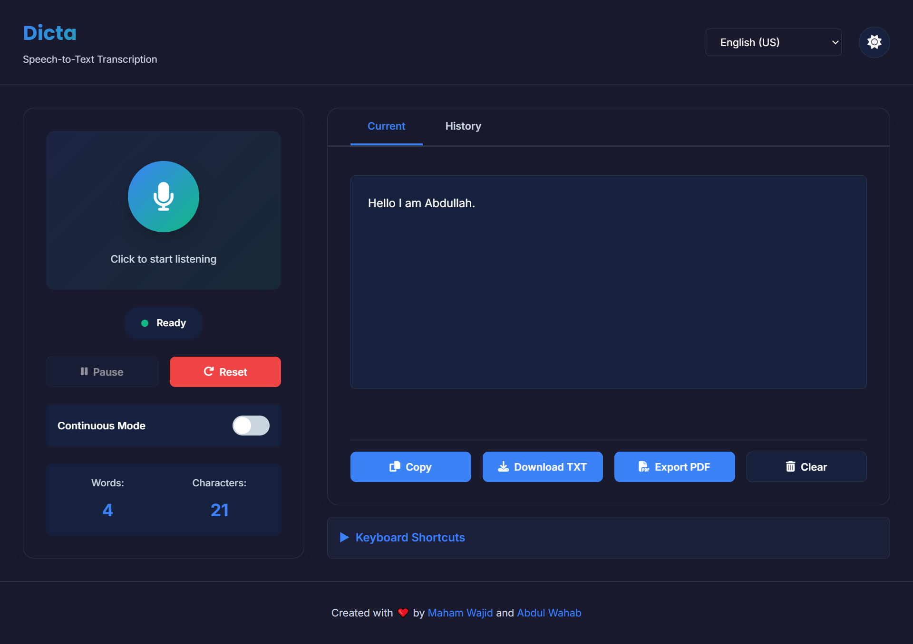

## Dicta - Modern Speech-to-Text Application ✨

A modern, feature-rich speech-to-text transcription application built with HTML, CSS, and JavaScript. Convert your voice into text with real-time transcription, multiple language support, and professional export options.

**Live Demo:** [https://maham-wajid.github.io/dicta-speech-to-text/](https://maham-wajid.github.io/dicta-speech-to-text/)

---

## 🌟 Features

### 🎨 Modern UI/UX
- **Glassmorphism Design** - Elegant frosted glass effect with backdrop blur
- **Smooth Animations** - Micro-interactions on buttons, microphone pulse effect, state transitions
- **Dark/Light Mode Toggle** - Persistent theme preference with smooth transitions
- **Fully Responsive** - Optimized for desktop, tablet, and mobile devices
- **Professional Layout** - Centered card design with clean typography

### 🎯 Core Transcription Features
- **Real-Time Transcription** - Live capture and display of speech
- **Multiple Languages** - Support for 10+ languages:
  - English (US & UK)
  - Spanish, French, German, Italian
  - Portuguese (Brazil)
  - Japanese, Chinese (Simplified), Korean
- **Auto Punctuation** - Automatically capitalizes and adds punctuation
- **Word/Character Count** - Live statistics while transcribing
- **Interim Results** - See predictions as you speak

### 🎮 Recording Controls
- **Start/Pause/Reset** - Full control over recording state
- **Continuous Mode** - Auto-restart listening for uninterrupted sessions
- **State Indicators** - Color-coded status (Ready, Listening, Paused, Error)
- **Visual Feedback** - Animated microphone with pulse effect when listening

### 📤 Export & Sharing
- **Copy to Clipboard** - One-click copy with keyboard shortcut (Ctrl+C)
- **Download TXT** - Save transcript as text file with date stamp
- **Export PDF** - Professional PDF with metadata, date, language, and word count
- **Transcription History** - View and restore past transcriptions
- **localStorage Persistence** - History saved locally on your device

### ⌨️ Accessibility & Shortcuts
- **Keyboard Shortcuts**:
  - `Space` - Start/Stop recording
  - `Ctrl+C` - Copy transcript
  - `Ctrl+D` - Download transcript
  - `Ctrl+R` - Reset transcript
- **ARIA Labels** - Proper semantic HTML for screen readers
- **Focus States** - Clear visual feedback for keyboard navigation
- **Tab Navigation** - Fully keyboard accessible
- **Screen Reader Support** - aria-pressed, aria-checked, aria-selected states

### 🔔 User Feedback
- **Toast Notifications** - Success, error, info, and warning messages
- **Live Status Messages** - Clear indication of listening state
- **Error Handling** - Graceful error messages for various scenarios
- **Button State Management** - Buttons enable/disable based on content

### 📱 Responsive Design
- **Desktop (1024px+)** - 2-column layout (controls + output)
- **Tablet (768px-1023px)** - Single column stacked layout
- **Mobile (480px-767px)** - Mobile-optimized buttons with icon-only mode
- **Extra Small (<480px)** - Compact layout with minimal padding

### 🌐 Browser Support
- Chrome/Chromium (recommended)
- Microsoft Edge
- Safari
- Firefox (limited support)
- Graceful fallback for unsupported browsers

---

## 🚀 Quick Start

1. **Clone or Download**
   ```bash
   git clone https://github.com/maham-wajid/dicta-speech-to-text.git
   cd dicta-speech-to-text
   ```

2. **Open in Browser**
   - Simply open `index.html` in a modern browser
   - Or serve with a local server:
   ```bash
   python -m http.server 8000
   # Then visit http://localhost:8000
   ```

3. **Start Speaking**
   - Click the microphone button
   - Allow microphone access when prompted
   - Speak naturally and watch your words appear

---

## 📖 How to Use

### Basic Recording
1. Click the **animated microphone** button to start listening
2. Speak clearly into your microphone
3. Click again to stop, or use `Space` key
4. See your transcript appear in real-time

### Language Selection
- Use the **language dropdown** in the header to select your preferred language
- Change anytime, even while recording

### Theme Selection
- Click the **moon/sun icon** in the header to toggle dark/light mode
- Your preference is saved automatically

### Exporting Your Transcript
- **Copy**: Press `Ctrl+C` or click Copy button
- **Download TXT**: Click Download button (saves as `.txt` file)
- **Export PDF**: Click Export PDF button (saves as `.pdf` file with formatted layout)

### History Management
- Click the **History tab** to view all previous transcriptions
- Click any history item to restore it to the current transcript
- Transcriptions are timestamped and persisted using localStorage

### Advanced Options
- **Continuous Mode**: Toggle to enable auto-restart when listening stops
- **Pause**: Click Pause button to temporarily stop without losing current text
- **Reset**: Clear current transcript and start fresh

---

## 🛠️ Tech Stack

- **HTML5** - Semantic markup with ARIA labels
- **CSS3** - Modern styling with CSS variables, Grid, Flexbox, and animations
- **JavaScript (ES6+)** - Vanilla JS with no external dependencies
- **Web Speech API** - Browser-native speech recognition
- **localStorage API** - Local data persistence
- **html2pdf.js** - PDF export functionality
- **Font Awesome Icons** - Professional icon library

---

## 📁 Project Structure

```
dicta-speech-to-text/
├── index.html           # Main HTML file
├── style/
│   └── style.css        # Global styles (modern UI, responsive design)
├── script/
│   └── script.js        # Core application logic (591 lines)
├── resources/
│   └── img/             # Images and assets
└── README.md            # Documentation
```

---

## 🎨 Design Features

### Glassmorphism
- Semi-transparent backdrop blur effect
- Layered shadows for depth perception
- Modern frosted glass aesthetic

### Color System
- **Light Mode**: Clean whites with blue accents (#3b82f6)
- **Dark Mode**: Dark backgrounds with contrasting text
- **Accessibility**: AA+ color contrast ratios

### Animations
- Smooth cubic-bezier transitions
- Microphone pulse during listening
- State indicator animations
- Toast notification slide-in/out
- Button hover and active states

---

## 🧠 Code Quality

- **Modular Architecture** - Organized functions with single responsibility
- **State Management** - AppState object for centralized state
- **DOM Caching** - DOM object for efficient element access
- **Clear Comments** - JSDoc-style function documentation
- **Error Handling** - Try-catch blocks and error messages
- **Browser Detection** - Graceful degradation for unsupported features

---

## 📊 Statistics Tracked

- **Word Count** - Real-time word count display
- **Character Count** - Character count in real-time
- **Language** - Current language selection
- **Timestamp** - Recording date and time
- **Duration** - Available in history

---

## 🔐 Privacy

- ✅ All processing happens locally in your browser
- ✅ No data sent to external servers (except Google's Web Speech API)
- ✅ History stored only in your local browser storage
- ✅ No tracking or analytics

---

## 🌍 Supported Languages

1. English (US & UK)
2. Spanish (Spain)
3. French (France)
4. German (Germany)
5. Italian (Italy)
6. Portuguese (Brazil)
7. Japanese (Japan)
8. Chinese (Simplified)
9. Korean (South Korea)

---

## ⚙️ Configuration

### Theme Persistence
- Automatically saves theme preference in localStorage
- Restores on page reload

### History Persistence
- Stores up to 50 transcriptions (adjustable in code)
- Saves with metadata (timestamp, language)
- Accessible from History tab

### Language Preference
- Defaults to English (US)
- Changes update in real-time
- Specific language selected in dropdown

---

## 🐛 Known Limitations

1. **Browser Support** - Web Speech API not available in all browsers
2. **Accuracy** - Varies based on browser and microphone quality
3. **Internet** - Most browsers require internet for recognition
4. **Microphone** - Requires working microphone device
5. **Continuous Mode** - May not work perfectly in all browsers

---

## 🚀 Future Enhancements

- [ ] Cloud sync for transcription history
- [ ] Multiple file export formats (DOCX, RTF)
- [ ] Audio playback for recorded transcriptions
- [ ] Translation support
- [ ] Speaker identification
- [ ] Advanced search in history
- [ ] Customizable punctuation rules
- [ ] Voice command recognition

---

## 📝 License

MIT License - Feel free to use this project for personal or commercial purposes.

---

## 👨‍💻 Author

Created with ❤️ by [Maham Wajid](https://github.com/Maham-Wajid) and [Abdul Wahab](https://github.com/abdul-wahab619)

---

## 📸 Screenshots

### Light Mode


### Demo Video
[Live Demo](https://github.com/maham-wajid/dicta-speech-to-text/raw/main/resources/dicta-speech-to-text-live-demo.mov)

---

## 🤝 Contributing

Contributions are welcome! Feel free to fork, submit issues, or create pull requests.

---

## 💡 Tips

- Use a quality microphone for better accuracy
- Speak naturally and clearly
- Use the language selector for non-English speech
- Enable dark mode for comfortable late-night use
- Check History tab to manage past transcriptions
- Use keyboard shortcuts for faster workflow

---

**Happy Transcribing! 🎤✨**

### Troubleshooting

- No prompt for microphone? Check browser permissions for the file or site.
- No transcription? Ensure the browser supports Web Speech API and try again.
- Silence breaks the text? Keep speaking or click to restart listening.

### Contributing

Pull requests are welcome. Open an issue to discuss a new feature or fix, then submit a PR.

### License

This project is provided for learning and demonstration purposes.
